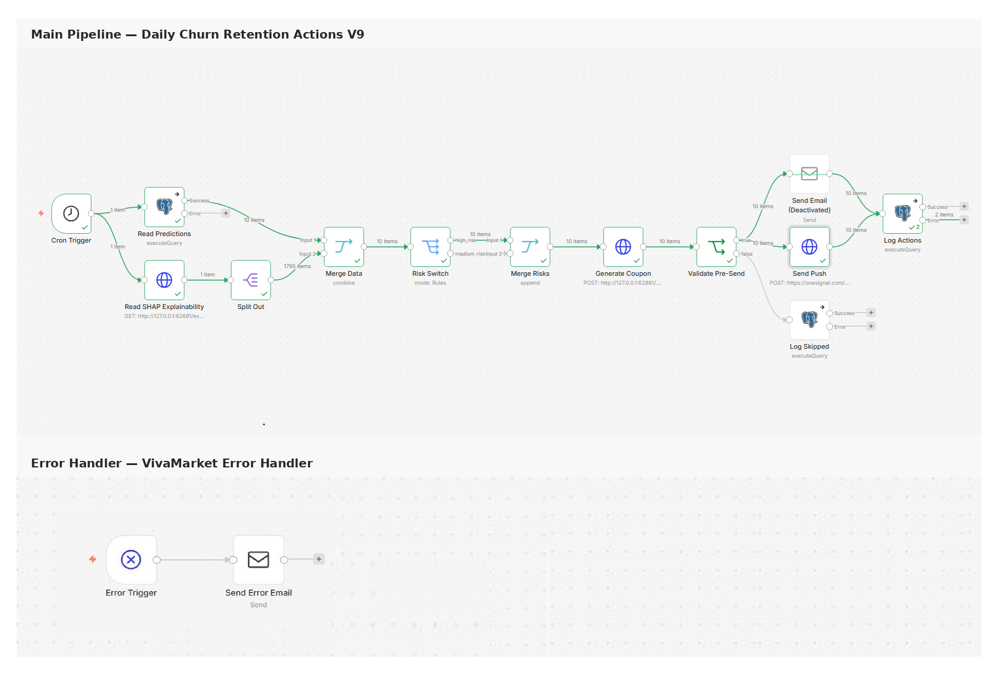

# Daily Customer Churn Predictor

**Spec-Driven Churn Intelligence System for VivaMarket Brasil**

[](https://www.python.org/)
[](https://xgboost.readthedocs.io/)
[](https://scikit-learn.org/)
[](https://jupyter.org/)
[](LICENSE)
[](#version-note)
[](#development-methodology)

---

## Executive Summary

> ⚠️ **BEFORE YOU START — ANALYTICAL BASELINE NOTE**: This repository contains both the historical **v1.0.0 published baseline** and the current synchronized **canonical V2C artifact line**. The original v1 baseline should not be interpreted as a final analytical definition of churn for VivaMarket Brasil: the 90-day forward target was structurally too positive-heavy, which kept average precision near **0.994** while limiting business separability (ROC AUC ~**0.589** on the v1 test split). The canonical V2C artifact line materially improves ranking quality (**ROC AUC ~0.8016**) through a redesigned `V2C` formulation, but the target remains positive-heavy and should still be interpreted cautiously. This is not a model failure — it is a consequence of marketplace dynamics, one-time-buyer dominance, and the difficulty of defining a truly retainable customer population. The limitation is explicit and should be handled as a genuine business-first analytical design problem.

This is a **personal deep-dive project** built after completing a Master's in Data Science to gain hands-on experience with production-oriented churn modeling in a realistic marketplace setting. It implements a **complete end-to-end churn workflow** for VivaMarket Brasil, covering the full path from raw SQLite extraction to scored retention queues, explainability outputs, automation-ready payloads, and business-facing HTML reporting.

The repository is intentionally framed as more than a model notebook chain: it now also documents the transition from pure analytical redesign into an **internal pilot / controlled operational activation baseline**, while keeping a clear boundary between that internal layer and any future fully hardened real-send customer-facing stack.

The goal was to go beyond a typical academic churn notebook and build a pipeline that addresses the real challenges of marketplace churn: irregular purchase behavior, analytically complex target definition, temporal consistency requirements, and the need to translate model scores into operational business decisions.

**Development approach:** This project was built using **The Architect (v1)**, a personal **Spec-Driven Data Science agent/workflow** developed alongside the project. Every notebook was analytically specified before being built, executed with OpenClaw agent support, and reviewed under explicit human supervision before the next step was started. The workflow prioritizes traceability, notebook-by-notebook QA, and clean versioned evolution over execution speed.

**Canonical V2C artifact line — key metrics:**

| Metric | Value | Context |
|:-------|:-----:|:--------|
| ROC AUC (test split) | ~0.8016 | Canonical `V2C` artifact line |
| Average Precision | ~0.9937 | Still influenced by positive-heavy target |
| Precision@Top 5% | 1.0000 | Held-out scored set |
| Precision@Top 10% | ~0.9970 | Held-out scored set |
| SHAP explainability | ✅ robust scored sample | NB06 |
| Deployment prep | ✅ scoring package + smoke test | NB07 |
| Orchestration | ✅ n8n workflow V9 — two-workflow architecture (main + error handler), executed end-to-end in production (Phase 2 internal orchestration, validated 2026-05-18) | NB08 |
| Reporting | ✅ branded HTML dashboard | NB09 |
| Model governance | ✅ Model Card (latest local publication layer) | Phase 3 |
| ROI framing | ✅ scenario-based ROI layer for stakeholder discussion | Phase 3 |

**Top churn driver families (canonical V2C artifact line):**

| Driver family | Interpretation |
|:--------------|:---------------|
| `frequency` | Purchase regularity and cadence degradation |
| `monetary` | Spend and value-related weakening |
| `recency` | Time since last purchase and recent inactivity |
| `experience / other` | Review, delivery, and residual quality signals |

**Key analytical finding:** The project demonstrates a technically complete and operationally coherent churn system, but the central modeling lesson remains the same: the most important next improvement is not blind tuning. It is a **business-first redesign of who counts as a retainable customer** and therefore who should enter the eligible modeling population.

---

## Quick Start

> **Current status:** NB01–NB09 complete with canonical executed notebooks. Phase 2 is complete and the n8n workflow (V9, two-workflow architecture) has been executed end-to-end in a real production environment. The synchronized Phase 3B baseline is now also operationally closed for the current internal-pilot scope: the repository includes Docker support, updated env-driven runtime configuration, passing scoring/API tests, refreshed workflow documentation, verified Drive backup, and the hardened n8n routing logic with explicit LOW-tier skip logging (`low_tier_dispatch_deferred_td12`). The current publication layer also includes a stronger Model Card and a scenario-based ROI layer aligned with an **internal-pilot-first / production-layer-later** roadmap.

### Running the notebook pipeline

```bash
# 1. Clone the repository
git clone https://github.com/albertosvallejo/daily-customer-churn-predictor.git
cd daily-customer-churn-predictor

# 2. Install dependencies
pip install -r requirements.txt

# 3. Place the source SQLite database in data/raw/
# Required: marketplace SQLite database compatible with the project extraction logic

# 4. Run notebooks in order (mandatory sequence)
# 01 → 02 → 03 → 04 → 05 → 06 → 07 → 08 → 09
```

### Running with Docker

```bash
docker build -t churn-vivamarket .
docker run --rm -p 8888:8888 churn-vivamarket
```

### Recommended execution context

- Python 3.11+
- Jupyter / Google Colab / local JupyterLab
- 8GB+ RAM for feature engineering and explainability sampling
- Source SQLite database placed in `data/raw/`

**Prerequisites:**
- All notebooks must be executed in sequence — each notebook's outputs feed directly into the next
- NB06 explainability is run on a robust scored sample to keep execution stable in the current environment
- NB07 generates a scoring package that NB08 consumes for the n8n blueprint

---

## Development Methodology

This repository was built as a **Spec-Driven Data Science project with OpenClaw agent support and explicit human supervision**.

**Spec-Driven** means every notebook was defined analytically before being built — inputs, outputs, transformations, and validation criteria were specified explicitly before any code was written. This reduces scope drift, makes QA tractable notebook by notebook, and produces artifacts whose lineage is traceable across the full pipeline.

**OpenClaw** is the execution environment and agent runtime used to execute and iterate on notebooks inside a structured workspace. It acts as the execution layer — running code, surfacing errors, and generating outputs — while analytical decisions, validations, and direction changes remain under human control.

**Human supervision** means no output was accepted without review. Every notebook's results were inspected against the spec before the next step was started. The agent accelerates execution; the human owns the analytical decisions.

### The Architect (v1)

The Spec-Driven workflow in this project was developed using **The Architect**, a personal **Spec-Driven Data Science agent/workflow** (v1) created specifically to structure data science work from analytical specification through to operational delivery.

A few honest notes about The Architect v1:

- It is a **personal agent/workflow**, not a published product. v1 was built and battle-tested for the first time on this project.
- It combines agent-assisted execution with explicit workflow discipline: specification first, controlled execution second, human review before progression.
- It runs with **OpenClaw agent support** and explicit human supervision rather than as a fully autonomous system.
- It will **evolve with each new project** as new DS execution patterns, QA needs, and operational edge cases emerge.

The result is a working style that emphasizes structured execution, notebook-by-notebook QA, operational traceability, reproducibility, and business-facing deliverables that can evolve cleanly across versions.

---

## Table of Contents

- [Project Context](#project-context)
- [Business Problem](#business-problem)
- [Development Methodology](#development-methodology)
- [Methodology](#methodology)
- [Modeling Approach](#modeling-approach)
- [Project Evolution](#project-evolution)
- [Results & Performance](#results--performance)
- [System Architecture](#system-architecture)
- [Notebook Pipeline Reference](#notebook-pipeline-reference)
- [Main Deliverables](#main-deliverables)
- [File Structure](#file-structure)
- [Technical Stack](#technical-stack)
- [Methodological Notes](#methodological-notes)
- [Known Limitations](#known-limitations)
- [Professional Improvement Roadmap](#professional-improvement-roadmap)
- [Future Work](#future-work)
- [Version Note](#version-note)
- [License & Contact](#license--contact)

---

## Project Context

### Why build a churn predictor for a marketplace in 2026?

Churn prediction in subscription businesses is comparatively clean: the event is defined (cancellation), the population is clear (active subscribers), and the label is explicit. Marketplace churn is much harder. There is no cancellation event. The population boundary is blurry. Most customers in many cohorts bought once and never returned, which may be normal behavior rather than churn. And "inactive for 90 days" means something very different for a customer with seven orders over two years than for a customer with a single purchase.

This project was built precisely in that harder context. The dataset reflects realistic marketplace dynamics, and the challenges it presents — one-time-buyer dominance, irregular interpurchase intervals, label leakage risk in temporal splits, and the difficulty of defining a truly retainable population — are the same challenges faced by real marketplace analytics teams.

The v1 baseline established a working end-to-end system, documented the known limitations honestly, and laid the foundation for a v2 redesign where the population and label definitions are revisited from first principles.

### Project background

This is a **personal deep-dive project** built after completing a Master's in Data Science to gain hands-on experience with production-oriented churn modeling, SHAP-based explainability, and automation-ready ML systems in a realistic ecommerce setting.

The goal was to go beyond typical course implementations and build a complete, operationally structured churn pipeline that addresses the challenges you actually face on marketplace data:

- analytically complex target definition with no natural churn event;
- population dominated by one-time buyers with no clear retention intent;
- temporal consistency requirements for feature engineering and model training;
- explainability that maps model outputs to business-actionable driver groups;
- automation-ready artifacts for downstream orchestration without over-engineering the serving layer;
- honest reporting when strong execution still reveals a real analytical constraint.

The result is a robust, well-documented workflow suitable for a senior data science / CRM analytics portfolio discussion.

### Business Context

VivaMarket Brasil is a marketplace-style ecommerce platform with a transactional customer base that purchases irregularly across multiple product categories.

**Core business challenge:** identify customers at risk of disengagement and translate model outputs into operational retention actions — discount offers, re-engagement communications, and loyalty reinforcement — in a way that can later be orchestrated automatically.

**Target user profile:** CRM manager or retention analyst responsible for daily operational decisions on which customers receive which incentives and through which channel.

---

## Business Problem

### Challenge Statement

The project addresses four interconnected analytical challenges typical of marketplace ecommerce:

**Ambiguous churn definition.** Unlike subscriptions, marketplaces have no cancellation event. Churn must be inferred from future inactivity over a chosen horizon, and that horizon interacts directly with who should count as an eligible customer.

**One-time-buyer dominance.** A large share of historical customers placed exactly one order and never returned. Including them blindly in the modeling base conflates normal single-purchase behavior with real disengagement.

**Temporal consistency.** Features must be computed strictly from history before the snapshot date, while the churn label must be computed strictly from future activity after that observation date. Any leakage breaks the analytical validity of the workflow.

**Operational translation.** A score is not a retention action. The pipeline must produce not only probabilities and tiers but also a payload that maps customers into actions, channels, and incentives that can be used operationally.

### Core Questions

1. Can we build a reproducible churn baseline from raw marketplace transactional data?
2. Can we map model scores into business-facing retention actions with a defensible tier logic?
3. Can we explain churn drivers clearly enough for operational stakeholders?
4. Can we prepare the outputs for daily automation without over-engineering the serving layer too early?

### Success Criteria

**Pipeline quality:**
- complete notebook execution `NB01 → NB09` with no broken artifact handoffs;
- temporal integrity across feature engineering and evaluation;
- explainability outputs generated successfully;
- retention payload covers the scored population;
- orchestration blueprint generated, importable, and executed end-to-end. ✅

**Business quality:**
- risk tiers map to differentiated retention actions;
- driver groupings are interpretable in business language;
- reporting artifacts are presentable to a non-technical stakeholder.

**Editorial quality:**
- notebooks and project-facing deliverables remain in English;
- VivaMarket Brasil visual identity is applied consistently;
- canonical executed notebooks are the single source of truth.

---

## Methodology

### End-to-End Flow

```text
Raw SQLite data
→ data cleaning + churn-oriented EDA
→ repeated customer snapshot engineering
→ temporal model training (XGBoost)
→ diagnostics + threshold analysis
→ explainability + driver grouping
→ deployment preparation (scoring package)
→ retention orchestration design + execution (n8n)
→ branded HTML reporting dashboard
```

### Data Foundation

The project works from a local SQLite ecommerce dataset and builds a modeling-ready customer-snapshot layer. Each snapshot represents a customer observed at a specific temporal checkpoint, with:

- behavioral features computed from history before the snapshot date;
- a future churn label computed from activity after the snapshot date;
- multiple snapshots per customer across different temporal windows.

This design allows the same customer to be observed at multiple lifecycle moments and better approximates an operational scoring setup.

### Feature Families

| Family | Features | Analytical role |
|:-------|:---------|:----------------|
| **Recency & frequency** | recency, order counts, cadence, activity windows | Primary churn signal |
| **Monetary** | revenue windows, AOV, freight, installments | Value segmentation |
| **Product breadth** | distinct categories, distinct products | Engagement depth |
| **Quality & experience** | review scores, delivery-related aggregates | Satisfaction signal |
| **Payment mix** | payment concentration, amount windows | Behavioral pattern |
| **Customer profile** | tenure and selected enrichments | Segment enrichment |

### Modeling Logic

The current synchronized artifact line uses the canonical **`V2C`** formulation:

- eligible base: `total_orders >= 2`
- tenure rule: `tenure_days >= 90`
- adaptive horizon: `min(150, max(75, round(1.25 * median_gap_days)))`
- fallback horizon: `75`

This formulation was chosen after a short controlled benchmark because it improved ranking quality while preserving the broadest operationally useful base among the tested candidates.

### Orchestration Positioning

The automation layer is implemented through **n8n**, which serves as the internal orchestration platform for Phase 2. The final architecture uses **two separate workflows**: the main pipeline (V9) and a dedicated error handler (`VivaMarket Error Handler`), connected through n8n's native Error Workflow mechanism in Settings. This two-workflow pattern avoids the known n8n issue where inline error nodes can be incorrectly auto-wired as main connections. Both workflows have been executed end-to-end in a real VPS environment, validating the full retention action pipeline from daily scoring through coupon generation, email and push notification dispatch, and database logging. A more hardened customer-facing delivery stack is scoped for a later production-hardening step once the underlying churn definition is analytically stable. The current repository state is better interpreted as an **internal operational validation baseline**: strong enough to demonstrate orchestration readiness and controlled activation logic, but still intentionally short of claiming a fully hardened real-send customer-facing system.

---

## Modeling Approach

### Modeling objective

Estimate the probability that a customer snapshot will satisfy the project's operational churn definition under the canonical `V2C` formulation, then convert that ranking into diagnostics, explainability, deployment outputs, and retention actions.

### Input population logic

The workflow is built on repeated customer snapshots rather than a single static table. This allows the project to:

- observe behavior through time,
- compute rolling behavioral aggregates,
- score the same customer across multiple temporal states,
- simulate a real churn-monitoring setup.

### Core feature families

The current feature space combines multiple behavioral blocks:

- **Recency and frequency**
- **Monetary behavior**
- **Product breadth**
- **Quality and experience signals**
- **Payment-mix features**
- **Customer profile enrichments**

### Model family and training logic

The training workflow uses a supervised gradient-boosting approach centered on **XGBoost**, supported by the broader scikit-learn evaluation stack. It was selected because it provides:

- strong nonlinear tabular performance,
- compatibility with heterogeneous engineered features,
- probability outputs and ranking suitability,
- straightforward SHAP integration.

### Validation and diagnostics logic

The project emphasizes downstream usefulness rather than a single headline metric. Diagnostics include:

- ROC AUC and average precision;
- Brier score;
- precision at top targeting bands;
- threshold trade-off tables;
- risk-tier mix summaries;
- dashboard-ready monitoring outputs.

### Explainability logic

`NB06` produces explainability on a robust scored sample. The goal is not only feature-importance ranking but business interpretation of churn drivers by risk tier. That explainability is then translated into driver-sensitive retention recommendations and VIP escalation logic.

### Operational decisioning logic

The canonical V2C artifact line uses percentile-based operational tiers derived from the scored population:

- **HIGH**: top 20%
- **MEDIUM**: next 30%
- **LOW**: bottom 50%

This is more coherent with the canonical `V2C` distribution than the old fixed probability bands.

---

## Project Evolution

This repository is deliberately presented as an evolving professional project rather than a one-shot notebook dump. The analytical story matters because the biggest lesson was not a hyperparameter tweak — it was learning how the business definition of the problem changes the model much more than small technical optimizations do.

### Phase 1 — Published v1 baseline

The original v1.0.0 baseline established the full end-to-end churn workflow:

- raw SQLite extraction,
- temporal feature engineering,
- supervised training and scoring,
- diagnostics,
- explainability,
- deployment-preparation assets,
- orchestration payloads,
- branded HTML reporting.

That baseline was useful because it proved the delivery chain worked from start to finish. But it also surfaced the central analytical weakness very clearly: the initial forward 90-day churn definition was too permissive for a marketplace context dominated by one-time buyers and irregular repurchase behavior.

### Phase 2 — Canonical V2C redesign + n8n operational validation ✅

The canonical V2C artifact line is a genuine redesign rather than a cosmetic continuation of v1. The main changes were:

- restricting the eligible population to customers with demonstrated recurrence potential,
- moving to the canonical `V2C` formulation,
- tightening the adaptive churn horizon to the `75-150` day bounded rule,
- preserving explicit comparability against the published v1 baseline,
- re-running diagnostics, explainability, deployment preparation, orchestration, and reporting on the redesigned analytical base.

This redesign materially improved ranking quality while keeping the key methodological caution visible: even the stronger V2 candidate still works on a highly positive-heavy label.

**Phase 2 also delivers a fully operational n8n orchestration layer (V9).** The final architecture uses two separate workflows connected through n8n's native Error Workflow mechanism: the main pipeline (`Daily Churn Retention Actions - V9`) handles the full business logic, while a dedicated `VivaMarket Error Handler` workflow manages failure alerting independently. This two-workflow pattern was adopted after resolving a known n8n issue where inline error nodes can be incorrectly auto-wired as main connections on the canvas. Both workflows were executed end-to-end in a real production environment (VPS + Docker + Postgres), validating the complete retention action pipeline: daily cron trigger, churn prediction retrieval from Postgres, SHAP explainability from the scoring API, risk routing, coupon generation, pre-send validation, email and push notification dispatch via OneSignal (credentials managed through n8n Variables), action logging with parameterized query bindings, and error alerting via the dedicated error handler. Phase 3B later hardened that baseline with governed LOW-tier handling, updated runtime/config alignment, and publication-layer cleanup. n8n therefore remains the internal orchestration platform, while the broader event-tracking, governed activation, and BI/dashboard evolution path is now framed explicitly as Phase 4.

### Phase 3 — Publication hardening + internal pilot framing

Once the V2C analytical line was stabilized, the project entered a professionalization layer focused on publication readiness and clearer operational framing:

- README restructuring around Spec-Driven development and human-supervised OpenClaw execution,
- dependency cleanup and Docker support,
- lightweight scoring tests,
- asset normalization and branded report consistency,
- a stronger dashboard layer, Model Card, and ROI simulation artifacts for stakeholder review,
- explicit positioning of the current orchestration stack as an **internal pilot / controlled activation baseline** rather than a fully hardened customer-facing delivery layer.

This means the repository now tells two stories at once: the historical v1 baseline that was already published, and the stronger canonical V2C artifact line that shows how the project matured analytically and operationally without pretending the business economics are already experimentally solved.

---

## Results & Performance

### v1 historical baseline

| Metric | Value | Context |
|:-------|:-----:|:--------|
| ROC AUC | ~0.589 | Positive-heavy 90-day baseline |
| Average Precision | ~0.994 | Inflated by class imbalance |
| Interpretation | ⚠ | Operationally complete, analytically constrained |

### Canonical V2C artifact line outcomes

| Metric | Value |
|:-------|:-----:|
| Rows | `9,571` |
| Unique customers | `1,795` |
| Snapshots | `14` |
| Target prevalence | `~0.9748` |
| Selected model | `XGBoost` |
| ROC AUC | `~0.8016` |
| Average Precision | `~0.9937` |
| Precision@Top 5% | `1.0000` |
| Precision@Top 10% | `~0.9970` |

### Operational completion

The current synchronized local chain is complete through:

- `NB05` diagnostics
- `NB06` explainability
- `NB07` deployment packaging
- `NB08` retention orchestration
- `NB09` reporting dashboard
- n8n workflow V9 — executed end-to-end in production ✅
- publication-layer Model Card for governance-oriented project communication ✅
- scenario-based ROI simulation for stakeholder discussion and internal pilot framing ✅

### Interpretation

The canonical V2C artifact line is technically complete and operationally much stronger than the original baseline in ranking quality. However, the core analytical caveat remains: the target is still highly positive-heavy, so calibration and threshold interpretation must remain cautious.

---

## System Architecture

```text
RAW SQLITE DATA
→ NB01 Data Cleaning
→ NB02 EDA
→ NB03 Feature Engineering / Snapshot Construction
→ NB04 Model Training / Benchmarking
→ NB05 Evaluation & Diagnostics
→ NB06 Explainability
→ NB07 Deployment Preparation
→ NB08 Retention Orchestration
→ NB09 Reporting Dashboard
→ n8n Workflow V9 — two-workflow architecture (main pipeline + error handler), daily cron execution (Phase 2 internal orchestration) ✅
```

**Operational outputs currently available:**
- scored predictions,
- diagnostics tables and HTML reports,
- explainability artifacts,
- scoring package,
- orchestration payload,
- reporting dashboard,
- synchronized Drive backup,
- importable n8n workflows (V9 main pipeline + VivaMarket Error Handler, executed and validated).

### Orchestration workflow — Phase 2 (n8n — two-workflow architecture, operationally validated)



> **Main pipeline (V9, executed in production and later hardened on 2026-05-26):** Cron-triggered daily pipeline: reads all eligible customers with `send_action_flag = TRUE` from the `churn_predictions` Postgres table, fetches SHAP explainability data from the internal scoring API, merges both inputs on `customer_unique_id`, and routes customers by churn probability via a Rules switch with three branches: high risk (≥ 0.75), medium risk (0.45–0.75), and low risk (< 0.45). HIGH and MEDIUM continue through coupon generation, pre-send validation, email dispatch (SMTP), optional push dispatch via OneSignal (credentials managed through n8n Variables `ONE_SIGNAL_API_KEY` / `ONE_SIGNAL_APP_ID`), and parameterized action logging. LOW-risk records are intentionally not dispatched yet; they are written to `retention_actions_skipped` with reason code `low_tier_dispatch_deferred_td12` so the audit trail remains complete while passive LOW-tier activation is deferred.
>
> **Error handler (VivaMarket Error Handler):** A separate two-node workflow — Error Trigger → Send Error Email — connected to the main V9 pipeline through n8n's native Error Workflow setting. This two-workflow pattern was adopted to avoid the known n8n canvas issue where inline error nodes can be incorrectly auto-wired as main connections. The error handler fires automatically on any uncontrolled failure in the main pipeline during scheduled production runs and emails the DS team with workflow name, failing node, timestamp, and error detail.
>
> All nodes executed successfully end-to-end in the production environment (VPS + Docker + Postgres). Importable workflow definitions:
> - `n8n/n8n_workflow_daily_churn_retention_workflow.json` — main pipeline V9
> - `n8n/n8n_workflow_error_handler_workflow.json` — VivaMarket Error Handler

#### n8n deployment notes (Phase 2 infrastructure)

The n8n workflow runs against a real infrastructure stack. The key deployment dependencies are:

- **Scoring API:** the churn service (`src/api/churn_service.py`) runs inside the OpenClaw container on port `62881`, exposing `GET /explainability/latest` and `POST /coupons/generate`. The API must be running before the workflow executes.
- **Docker network:** n8n must be connected to the OpenClaw container network to reach the scoring API by hostname. This is achieved with `docker network connect openclaw-opvz_default n8n`. This connection persists while both containers are running; it must be re-applied if the n8n container is recreated.
- **Postgres:** the `churn_predictions` table must be populated before the workflow runs. In the validated Phase 3B baseline this is already handled as part of the hardened operational flow; the next evolution step is to connect that baseline to the broader Phase 4 event-tracking and governed activation layers.
- **OneSignal credentials:** managed through n8n Variables (`ONE_SIGNAL_API_KEY`, `ONE_SIGNAL_APP_ID`). The `$credentials.x` syntax is not supported in HTTP Request nodes and was replaced in V9.
- **Error handler:** the `VivaMarket Error Handler` workflow must be in Published (active) state before linking it in the main V9 Settings. n8n only lists Published workflows in the Error Workflow dropdown. Importing a workflow JSON updates canvas nodes and connections but does not update the Error Workflow field in Settings — this must be set manually from the n8n UI.
- **Production query:** the current workflow now targets all eligible records with `send_action_flag = TRUE`, and the next hardening step is to keep that governed flow tied to current-day lineage and later Phase 4 measurement hooks.

---

## Notebook Pipeline Reference

Each notebook has a defined role and the execution sequence is mandatory.

**Execution order:** `01 → 02 → 03 → 04 → 05 → 06 → 07 → 08 → 09`

### Canonical notebooks

- `notebooks/01_data_cleaning.ipynb`
- `notebooks/02_eda_exploratory.ipynb`
- `notebooks/03_feature_engineering.ipynb`
- `notebooks/04_model_training.ipynb`
- `notebooks/05_model_evaluation_diagnostics.ipynb`
- `notebooks/06_churn_attribution_explainability.ipynb`
- `notebooks/07_model_deployment_preparation.ipynb`
- `notebooks/08_n8n_orchestration.ipynb`
- `notebooks/09_reporting_dashboard.ipynb`

Project rule: each step is represented by **one canonical `.ipynb` file only**. The kept notebook is the executed and debugged version.

---

## Main Deliverables

### Processed data artifacts

Examples from the canonical pipeline artifact run (`20260506`) that the downstream notebooks now treat as the shared run tag:

- `data/processed/churn_features_20260506.parquet`
- `data/processed/churn_predictions_20260506.parquet`
- `data/processed/churn_model_metrics_20260506.csv`
- `data/processed/churn_diagnostics_20260506.csv`
- `data/processed/churn_explainability_20260506.parquet`
- `data/processed/churn_driver_summary_20260506.csv`
- `data/processed/churn_inference_smoke_test_20260506.parquet`
- `data/processed/churn_model_comparison_20260506.csv`
- `data/processed/churn_variant_benchmark_20260506.csv`
- `data/processed/retention_actions_20260506.parquet`

### Models and scoring assets

- `models/churn_model_20260506.joblib`
- `models/churn_scoring_package_20260506.joblib`
- `src/models/churn_scoring.py`

### Reporting and orchestration outputs

- `reports/model_diagnostics_20260506.html`
- `reports/churn_explainability_20260506.html`
- `reports/n8n_orchestration_20260506.html`
- `reports/churn_monitoring_dashboard_20260506.html`
- `n8n/n8n_workflow_daily_churn_retention_workflow.json` — main pipeline V9 (Phase 2 executed and validated 2026-05-18; Phase 3B hardening aligned 2026-05-26)
- `n8n/n8n_workflow_error_handler_workflow.json` — VivaMarket Error Handler (Phase 2, separate error workflow)
- `assets/images/n8n_workflow_phase2.png` — visual diagram of the orchestration workflow

---

## File Structure

```text
daily-customer-churn-predictor/
├── README.md
├── .gitignore
├── requirements.txt
├── STATUS.md
├── RELEASE_NOTES_v1.md
├── Dockerfile
├── .dockerignore
├── notebooks/
├── data/
├── models/
├── src/
├── n8n/
│   ├── n8n_workflow_daily_churn_retention_workflow.json
│   └── n8n_workflow_error_handler_workflow.json
├── reports/
├── tests/
├── assets/
│   └── images/
│       ├── logo.gif
│       ├── visual_identity_guide_v1.pdf
│       └── n8n_workflow_phase2.png
```

Project rule: public notebook continuity is represented by canonical executed notebook files only. Temporary variants and draft artifacts are not part of the kept publication state.

Operational traceability rule: `STATUS.md` is the working project log. After each material notebook, orchestration, or publication-layer update, refresh `Current state`, `Last completed step`, and `Next pending step` before reporting completion.

---

## Technical Stack

| Category | Technology | Purpose |
|:---------|:----------:|:--------|
| Language | Python 3.11 | Core development |
| Modeling | XGBoost | Binary churn classification |
| ML utilities | scikit-learn | Evaluation and model workflow |
| Explainability | SHAP | Feature attribution |
| Data manipulation | pandas / NumPy | Pipeline data handling |
| Visualization | matplotlib / seaborn / Plotly | Reporting and charts |
| Database I/O | SQLite / PostgreSQL | Source data layer + operational scoring store |
| Columnar I/O | pyarrow / parquet | Artifact persistence |
| Serialization | joblib | Model/package export |
| Orchestration | n8n (two-workflow architecture) | Internal automation platform (Phase 2, operationally validated) |
| Notebook environment | Jupyter / Colab / JupyterLab | Execution layer |
| Agent support | OpenClaw | Spec-Driven execution support |
| Containerization | Docker | Reproducible execution environment |

---

## Methodological Notes

### 1. Snapshot-based temporal modeling

Rather than building a single static customer table, the workflow constructs customer snapshots at multiple temporal checkpoints. This better reflects a daily churn-scoring system, where the same customer must be evaluated across different lifecycle states.

### 2. Explainability sample vs. full population

The explainability layer is computed on a robust scored sample rather than on the full population to keep execution stable in the current environment. This is acceptable for the current project stage, but full-population explainability or a scalable approximation would be desirable in a later version.

### 3. Population definition is a business decision first

The most important analytical lesson from the project is that the eligible population for a marketplace churn model cannot be defined by data convenience alone. Deciding who is actually retainable is a business-first decision.

### 4. n8n as the internal orchestration platform (Phase 2 — operationally validated)

Using n8n as the internal orchestration platform for Phase 2 is a deliberate sequencing choice: it provides a fully operational automation layer that validates end-to-end pipeline readiness without over-investing in customer-facing infrastructure before the analytical base is fully stabilized.

The n8n workflows included in this repository are the **V9 implementation, executed end-to-end in a real production environment on 2026-05-18 and later hardened during the 2026-05-26 Phase 3B closure pass**. The final architecture uses two separate workflows: the main pipeline (`n8n/n8n_workflow_daily_churn_retention_workflow.json`) and a dedicated error handler (`n8n/n8n_workflow_error_handler_workflow.json`), connected through n8n's native Error Workflow mechanism in Settings. This two-workflow pattern was adopted to resolve a known n8n issue where inline error nodes can be incorrectly auto-wired as main connections on the canvas. The main pipeline covers the complete internal retention flow: daily cron trigger, prediction retrieval from Postgres, SHAP explainability from the scoring API, risk-tier routing, coupon generation, pre-send validation, email and push notification dispatch (OneSignal credentials managed through n8n Variables), parameterized action logging, and skipped record logging.

The architecture separates two complementary layers that are not mutually exclusive:

- **Layer 2 — Internal orchestration (n8n, Phase 2):** manages the DS pipeline, reads scored predictions, generates coupons, dispatches notifications, and logs all actions. This layer is operational and remains valid in later project stages.
- **Layer 3 — Governed activation and feedback loop (Phase 4 path):** extends Layer 2 with the next-stage operational stack — channel governance, event tracking, conversion feedback, and measurement-aware activation — consuming the same retention payload as the contract between layers.

The production-grade customer-facing automation — oriented to scalable channel delivery, operational governance, and closed-loop measurement — is scoped for a **later hardening phase**, once the underlying churn definition is analytically stable and the business population design decisions have been resolved. In the current repository state, the stronger and more honest framing is: **internal pilot first, production delivery layer later**.

---

## Known Limitations

1. Even after the `V2C` redesign, the churn target remains highly positive-heavy.
2. Calibration should be interpreted cautiously despite strong ranking metrics.
3. Explainability is sampled rather than full-population SHAP.
4. Operational thresholds are still strategy-oriented rather than fully ROI-optimized.
5. The n8n workflow is the current internal orchestration platform; it is strong enough for internal pilot / controlled validation framing, but it should not yet be presented as the final customer-facing delivery layer.
6. The current ROI layer is scenario-based and useful for stakeholder discussion, but it is not causal or experimentally validated.
7. The feedback loop is not live yet: event capture, conversion attribution, and observed campaign-performance measurement still belong to the next implementation phase.
8. Explainability artifact lineage for the later 20260519 state should still be documented more explicitly so the canonical post-Phase-3B handoff is unambiguous.

---

## Professional Improvement Roadmap

### Priority analytical upgrades

1. **Business-first population redesign**
2. **Further churn label refinement**
3. **Parallel CLV / value layer**
4. **Probability calibration**
5. **ROI-based threshold optimization**
6. **Structured cohort analysis**
7. **Uplift / incremental-response modeling**

### Governance and MLOps upgrades

8. **Observed campaign KPI layer**
9. **Drift monitoring with explicit cadence**
10. **Feature-importance stability checks across time**
11. **Model Card upgrade from scenario-based to evidence-enriched**
12. **Stronger artifact lineage and post-release technical governance**

### Strategic sequencing recommendation

1. Preserve explicit comparability between the historical **v1.0.0** baseline and the current **canonical V2C / Phase 3B** state.
2. Treat **Phase 4** as the next concrete implementation stage after publishing `v3.0.0-phase3b`.
3. Reopen deeper analytical redesign only after operational measurement data exists and the business-first population question can be revisited with evidence.

---

## Future Work

### Phase 4 — Next implementation stage

1. Publish release `v3.0.0-phase3b` on GitHub as the formal start gate.
2. Resolve TD-14 by documenting or regenerating the canonical explainability artifact lineage for the post-Phase-3B baseline.
3. Configure OneSignal with real credentials and verify `external_id = customer_unique_id` in the effective dispatch path.
4. Activate LOW-tier dispatch only after governance conditions are satisfied, replacing `low_tier_dispatch_deferred_td12` with real controlled delivery.
5. Implement the feedback loop: OneSignal webhook receiver, `retention_events`, conversion detection, and campaign KPI capture.
6. Add governance and monitoring: weekly drift checks, feature-stability checks, and an evidence-enriched Model Card.
7. Build the BI/dashboard layer in demo mode first, then switch to live mode once enough campaign data exists.

### Longer-term analytical evolution

1. Revisit churn-eligibility population design from a business-first perspective.
2. Refine the churn target if the observed feedback loop supports a better retainable-population definition.
3. Add predictive CLV as a parallel decision layer.
4. Recalibrate thresholds with observed ROI logic instead of scenario assumptions only.
5. Implement structured cohort analysis.
6. Add uplift / incremental-response modeling.
7. Re-run the downstream notebook chain only if the analytical base changes materially.

---

## Version Note

This README documents the **current synchronized canonical V2C artifact line with Phase 2 complete and Phase 3B operationally closed for the internal-pilot scope**. The earlier GitHub publication corresponded to the **v1.0.0 baseline**. The next public release should preserve explicit comparability between that historical baseline and the current Phase 3B state, document the n8n V9 operational validation plus LOW-tier governance-safe routing, and position **Phase 4** as the next implementation stage for event tracking, governed channel activation, and BI/dashboard evolution.

---

## License & Contact

**Personal Portfolio Project — All Rights Reserved**

This project was built as a personal deep-dive into production-grade churn modeling after completing a Master's in Data Science with AI. The VivaMarket Brasil business context is a project framing construct used for portfolio-quality analytical storytelling.

If you reuse ideas or workflow patterns from this repository, attribution is appreciated.

**Project Author:**
- **Name:** Alberto Sánchez
- **LinkedIn:** https://www.linkedin.com/in/albertosvallejo/
- **GitHub:** https://github.com/albertosvallejo/

---

**Last Updated:** May 26, 2026  
**Canonical artifact line:** 20260506 · n8n V9  
**Status:** NB01–NB09 Complete · Phase 2 Complete · n8n V9 Executed (two-workflow architecture) · Phase 3B Operational Baseline Closed · Publication Layer Synchronized · v1.0.0 Baseline Published · Canonical V2C Artifact Line Active · Phase 4 Plan Defined

---

*This README serves both as technical documentation and as a publication-oriented narrative of the project's analytical evolution from the published v1 baseline through the synchronized canonical V2C artifact line, Phase 2 operational validation, and the current internal-pilot-first publication framing.*
